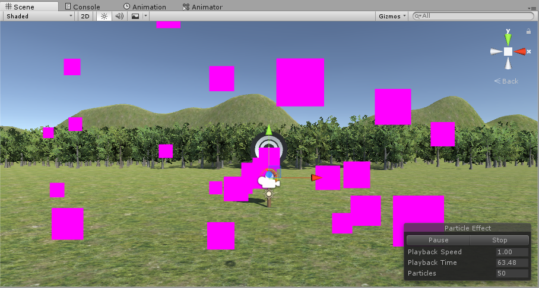
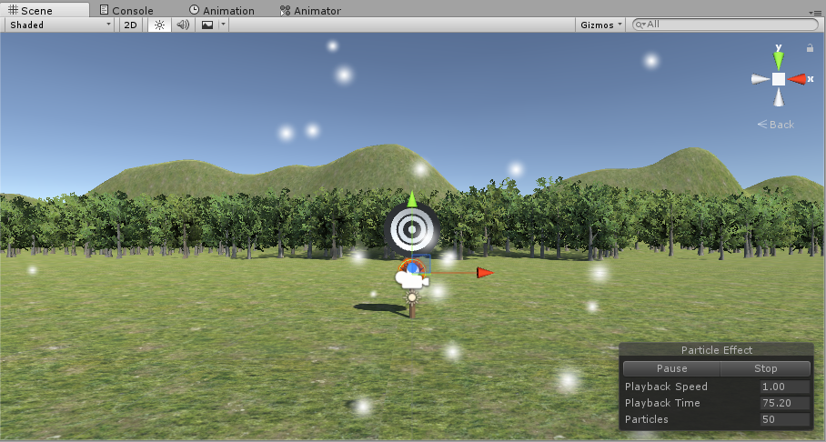
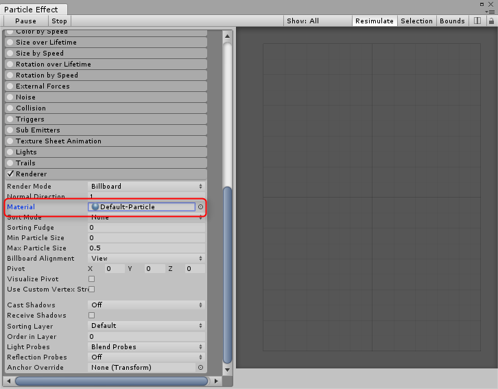

Unity5.5のParticle Systemは初期マテリアルがNoneになっているので白い粒子ではなくピンクの四角になってしまう。

Particle Effect -> Render -> Materialに`Default-Particle`を設定すると白い粒子になる。

MaterialがNoneの場合

MaterialがDefaultの場合

Perticle Effectの設定画面

